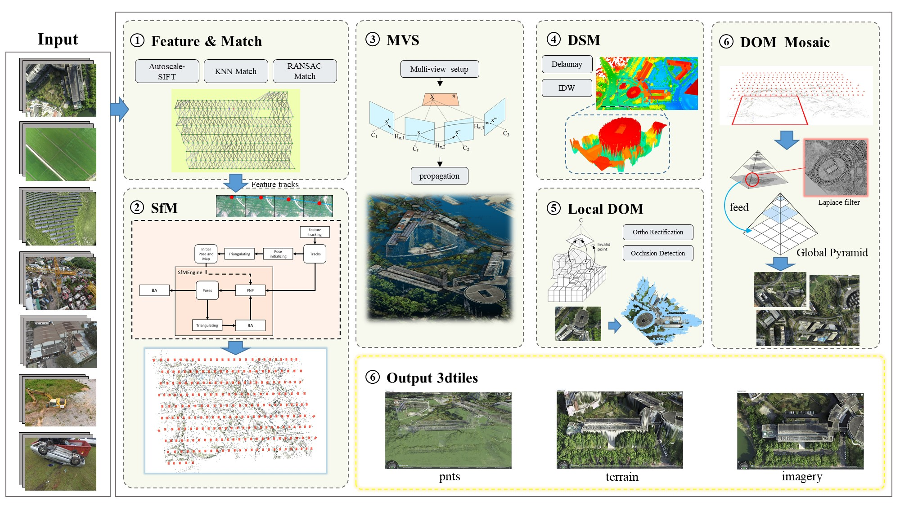
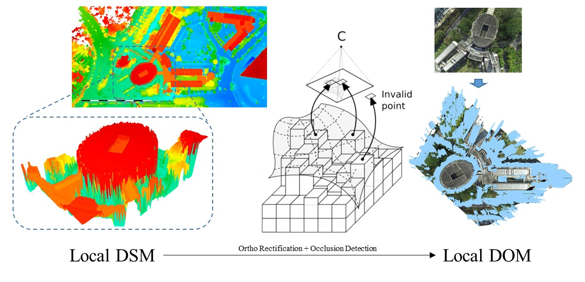

# UnityMapper

关键技术：Autoscale-SIFT, Incremental SfM, SGBM, PatchMatch, Ortho Rectification, Occulusion Detection

youtube：https://youtube.com/watch?v=xxx

Credits:

[openMVG](https://github.com/openMVG/openMVG)

[openMVS](https://github.com/cdcseacave/openMVS)

